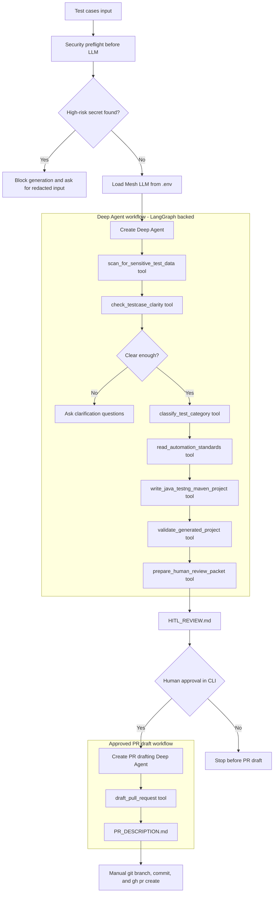

# Deep Agents Practice: Test Script Generator

This folder is a beginner-friendly Deep Agents practice area for a test script
generator. The target automation stack is Java + TestNG + Maven.

The first version focuses on the end-to-end workflow:

1. Scan test cases for literal credentials, tokens, secrets, and user identifiers.
2. Check whether the input test cases are clear enough to automate.
3. Classify the test as web or non-web, with API and database as non-web
   implementation categories.
4. Read local automation standards from `automation-standards`.
5. Generate a Java TestNG Maven project.
6. Compile or statically validate the generated project.
7. Create a human-in-the-loop review packet.
8. After human approval, draft a local PR description.

## Deep Agent Flow



In this starter, Deep Agents are LangGraph-backed, while the human approval
gate is handled by the CLI. A later version can move the approval gate into a
native LangGraph interrupt/resume flow.

The PR step is local in this starter. It creates `PR_DESCRIPTION.md` and the
commands you can run when a Git remote and GitHub authentication are available.

## Files

- `automation-standards/api-tests.md`
- `automation-standards/web-tests.md`
- `automation-standards/database-tests.md`
- `concepts/01_task_planning_and_subagents.py`
- `concepts/02_virtual_filesystem_permissions.py`
- `concepts/README.md`
- `test-script-generator/test_script_generator.py`
- `test-script-generator/sample-testcases/order-status-api.md`
- `test-script-generator/sample-testcases/login-web-needs-clarification.md`
- `test-script-generator/sample-testcases/login-with-credentials-blocked.md`

## Concept Mini Lab

The `concepts` folder teaches two Deep Agents features from the LangChain
overview before you jump into the larger test script generator.

### 1. Task Planning And Subagents

Deep Agents include a built-in `write_todos` planning tool and a built-in
`task` tool for launching short-lived subagents. Use this when a request has
independent pieces of work that should be isolated from the parent context.

Dry-run lesson:

```powershell
uv run python deepagents\concepts\01_task_planning_and_subagents.py
```

Real Mesh-backed run:

```powershell
uv run python deepagents\concepts\01_task_planning_and_subagents.py --real
```

### 2. Virtual Filesystem And Permissions

Deep Agents include virtual filesystem tools such as `ls`, `read_file`,
`write_file`, `edit_file`, `glob`, and `grep`. Permission rules let you allow
or deny reads and writes for specific virtual paths. The real run intentionally
attempts one denied read under `/secrets` and one denied write under
`/protected` so the boundary is visible.

Dry-run lesson:

```powershell
uv run python deepagents\concepts\02_virtual_filesystem_permissions.py
```

Real Mesh-backed run:

```powershell
uv run python deepagents\concepts\02_virtual_filesystem_permissions.py --real
```

See `concepts/README.md` for the full explanation.

## Run Without LLM First

Use this to understand the flow and verify the generator mechanics:

```powershell
uv run python deepagents\test-script-generator\test_script_generator.py --sample --dry-run
```

Auto-create the local PR draft in dry-run mode:

```powershell
uv run python deepagents\test-script-generator\test_script_generator.py --sample --dry-run --auto-approve
```

Check the credential/security flagging path:

```powershell
uv run python deepagents\test-script-generator\test_script_generator.py --input-file deepagents\test-script-generator\sample-testcases\login-with-credentials-blocked.md --dry-run
```

## Run With Deep Agents And Mesh LLM

The script loads the LLM from the repo `.env`:

```env
MESH_API_KEY=...
MESH_API_URL=...
MESH_MODEL=...
MESH_TEMPERATURE=0.2
MESH_TIMEOUT_SECONDS=60
```

Run the real Deep Agent flow:

```powershell
uv run python deepagents\test-script-generator\test_script_generator.py --sample
```

Run with your own test case file:

```powershell
uv run python deepagents\test-script-generator\test_script_generator.py --input-file .\my-testcases.md
```

The generated Java projects are written under:

```text
deepagents/generated-tests/
```

## Production Readiness Gaps

This is not production grade yet. It is a learning starter that demonstrates
the shape of the workflow.

Before production use, add:

- Native LangGraph interrupt/resume for HITL instead of a simple CLI prompt.
- Durable checkpoints, run IDs, audit trails, and resumable workflow state.
- Project memory/context: existing framework conventions, reusable base classes,
  approved locators, environment config rules, historical review decisions, and
  generated-test lineage.
- Retrieval over the real automation framework repository instead of only local
  markdown standards.
- A stronger secrets/PII policy with allowlists, redaction before LLM calls,
  enterprise secret scanning, and mandatory security review for flagged input.
- Real Java/Maven validation in CI, including compile, unit checks, linting,
  framework-specific smoke tests, and generated code quality gates.
- Real PR creation through GitHub/GitLab/Azure DevOps APIs with branch strategy,
  reviewers, labels, and failure handling.
- Observability: structured logs, traces, metrics, prompt/tool call records, and
  cost/token tracking.
- Access control for who can generate, approve, and raise PRs.
- Evaluation tests for classification, clarification quality, credential
  detection, code generation, and PR-review quality.

## Learning Notes

The Deep Agent receives a Mesh-backed `ChatOpenAI` model object, not just the
raw model name. That matters because Mesh model names may not look like native
LangChain provider strings.

The root folder is named `deepagents` for your practice content, which can
shadow the installed package if code is run from the repo root with `python -c`.
The runnable script is nested under `test-script-generator` so `from deepagents
import create_deep_agent` resolves to the installed package.
